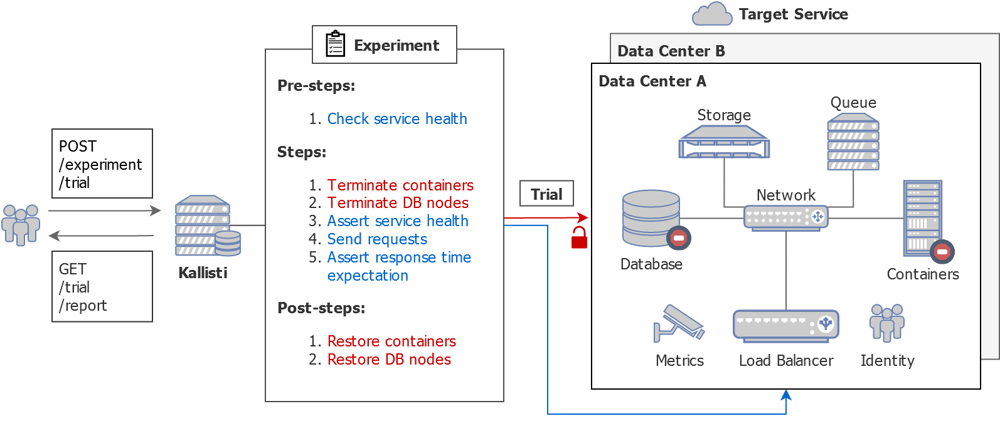
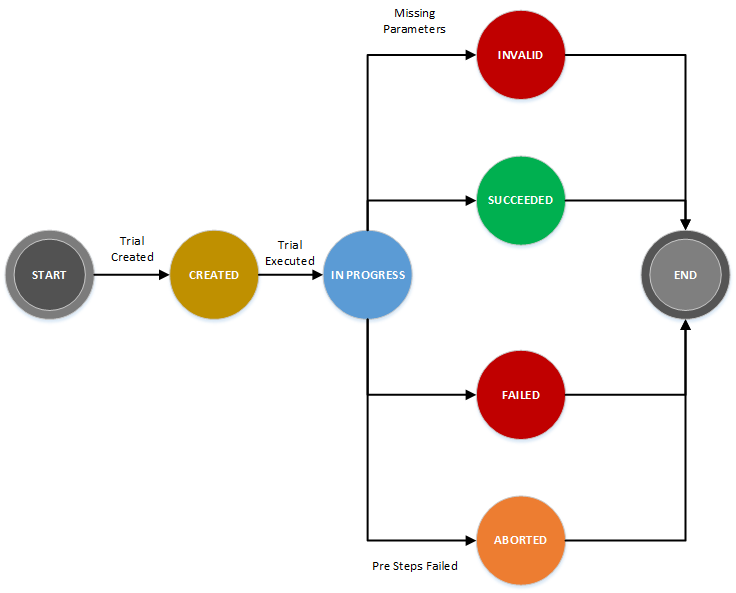
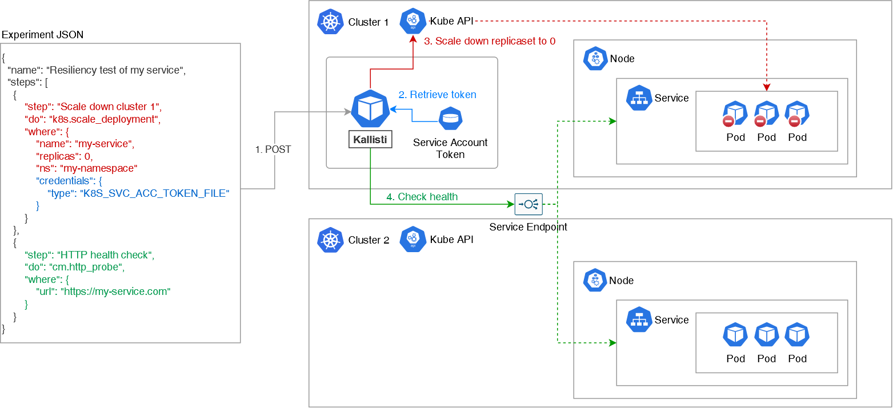

# Concept of Kallisti

* [Overview](#overview)
* [Definitions](#definitions)
  * [Experiment](#experiment)
    * [Step](#step)
    * [Pre Steps](#pre-steps)
    * [Post Steps](#post-steps)
    * [Metadata](#metadata)
  * [Trial](#trial)
    * [Trial Execute Request](#trial-execute-request)
    * [Trial Get Response](#trial-get-response)
    * [Trial Status](#trial-status)
* [Example in Kubernetes](#example-in-kubernetes)

## Overview



Kallisti is a self-contained control plane with REST API written in Python. As
shown in the diagram above, upon API request, Kallisti injects system turbulence
to the target platform through API calls, and evaluates how the target service
behaves by validating HTTP responses and/or metrics data. This set of steps for
a chaos injection and a behavior evaluation is called `experiments` in Kallisti 
and it is defined as a JSON file.

## Definitions

### Hypothesis

A Hypothesis is a theory of how your application/system should perform under
a given set of turbulent (non-ideal) conditions. It usually consists of two
parts:

1. The turbulent conditions that could happen to the system
2. Expected behavior of the system under the turbulent conditions

For example, if you are running in active-active mode in two availability 
zones (AZ), your hypothesis could be:

> Given, an AZ is unavailable `(Part1: Turbulent condition)`, my application
 will continue to perform as usual `(Part2: Expected behaviour)`

### Experiment

An experiment is a plan to validate a hypothesis in Kallisti.

> **Note:**
>
> An experiment is only a `plan` and does not perform any action when submitted
> to Kallisti. 
> An experiment can be executed repeatedly on demand or in a scheduled manner. 
> Each execution of an experiment is referred to as a [trial](#trial).
> Creating an experiment in Kallisti is a safe operation.

```json
{
  "name": "Kill application in one DC (inter-pool resiliency pattern)",
  "description": "Kill application in data center and check the load balancer endpoint",
  "pre_steps": [
    {
      "step": "HTTP Health Check",
      "do": "cm.http_probe",
      "where": {
        "url": "https://my-service.com/health"
      }
    }
  ],
  "steps": [
    {
      "step": "Stop App",
      "do": "cf.stop_app", 
      "where": {
        "app_name": "my-app",  
        "cf_api_url": "https://cf-api.data-center-1.com",
        "space_name": "dev",
        "org_name": "my-org"
      }
    },
    {
      "step": "HTTP Health Check",
      "do": "cm.http_probe",
      "where": {
        "url": "https://my-service.com/health"
      }
    }
  ],
  "post_steps": [
    {
      "step": "Start App",
      "do": "cf.start_app",
      "where": {
        "app_name": "my-app",  
        "cf_api_url": "https://cf-api.data-center-1.com",
        "space_name": "dev",
        "org_name": "my-org"       
      }
    }
  ]
}
```

#### Experiment Fields:

| Name                      | Required | Description |
|---------------------------|----------|-------------|
| name                      | Yes      | Short description of the experiment and it is usually used in logging and reporting for identifying the experiment.
| description               | No       | Long detailed description of the experiment.
| [metadata](#metadata)     | No       | Key value pairs that can be used to label a set of experiments.
| [pre_steps](#pre-steps)   | No       | List of actions that that will be executed before steps have been executed.
| [steps](#step)            | Yes      | List of actions that that will be executed in sequential order.
| [post_steps](#post-steps) | No       | List of actions to be executed after steps have been executed. These post_steps will be executed if the outcome of one or more of the experiment steps is not successful or when the outcome of all of the experiment steps is a success.
| [parameters](#parameters) | No       | Key value pairs that can be called in the experiment steps, usually represent the environment configurations associated with an experiment.

##### Step

A step is an atomic action that Kallisti needs to run as part of an experiment. It
is defined in the following format:

* **step** (Required): A short name describing the action to take.
* **do** (Required): Defines the Kallisti command to run. A command consists of
two parts, the namespace and the command name.
* **where** (Required): Key value pairs describing the environment and
parameters to execute the command. You may use template
[parameters][parameters] here. 
* **expect** (Optional): Key value pairs describing the value expected from
executing the step to validate the hypothesis. 

> **Note:**
> 
> A step would be marked `Failed` when the operation of a step does not succeed
> or the validation of `expect` fails. Please refer to the
> [module page][modules] for the details of step operations.

##### Pre Steps

Chaos experiments allow you to "break things on purpose" to learn how to build
a more resilient system. But you would not like to inject failure when your
system is already under attack. 

Kallisti experiments allow users to define a list of pre-steps (defined as
`pre_steps`) which are executed before the execution of any step to inject
failure. Using this feature, you can ensure that the your application/system is
in good health and ready for failure injection.

> **Note:**
> 
> If the `pre_steps` fail irrespective of the success or failure of experiment
> steps, the trial will be marked as `Aborted` (See
> [Trial Status](#trial-status) for more details.) and the experiment steps will
> not be executed.

##### Post Steps

Kallisti allows users to define a list of post steps to be executed after the
chaos experiment steps have been executed. These post_steps will be executed
if the outcome of one or more of the experiment steps is not successful or
when the outcome of all of the experiment steps is a success. Using this
feature, you can undo any configuration changes that may have been done as
part of the chaos experiment steps.

> **Note:**
> 
> If the post steps fail irrespective of the success or failure of individual 
> experiment steps, the trial will be marked as `Failed`.


##### Metadata

A metadata field is a dictionary field defined in an experiment, trial or
schedule in which the key value pairs can be used to identify a group of the
respective Kallisti objects.

###### How It Works

* If the experiment has a `metadata` defined, then the `metadata` will be
  inherited by the trial or schedule.
* If the `metadata` in the trial/schedule is defined with a different set of
  key value pair, the key value pair of the `metadata` of the experiment is
  appended to the `metadata` of the trial/schedule. 
* If the `metadata` of the trial/schedule has the same key as that of the
  experiment, the key value pair in the `metadata` of the trial/schedule will
  override the key value pair in the metadata of the `experiment`.

The resulting `metadata` of the trial/schedule in different scenarios is given
in the table below:

| Metadata provided in Experiment   | Metadata provided in Trial/Schedule | Metadata used during Trial Execution |
|-----------------------------------|-------------------------------------|--------------------------------------|
| `{}`                              | `{}`                                | `{}`
| `{"type": "inter-pool"}`          | `{}`                                | `{"type": "inter-pool"}` 
| `{}`                              | `{"type": "inter-pool"}`            | `{"type": "inter-pool"}`
| `{"type": "inter-pool"}`          | `{"name": "hello-world"}`           | `{"type": "inter-pool", "name": "hello-world"}`
| `{"type": "inter-pool"}`          | `{"type": "high-resiliency"}`       | `{"type": "high-resiliency"}`

### Trial

A trial is an instance of an experiment execution. A trial is initiated against
an experiment and runs the steps of the experiment, generates the result and
validates against the expect parameter if provided. The trial details are
recorded for audit purposes and can be retrieved by the user.

#### Trial Execute Request

Below is what a sample request to execute a trial would look like:

```json
{
  "experiment": "698e2183-fb16-478f-80c2-ea0080a89417",
  "parameters": {},
  "ticket": {}
}
```

##### Trial Execute Request Fields:

| Name                     | Required | Description |
|--------------------------|----------|-------------|
| experiment               | Yes      | `id` of the experiment you are going to execute.
| [parameters][parameters] | No       | Key value pairs used to interpolate the template parameters in experiment `steps`.
| ticket                   | No       | Key value pairs used to link with external system.
| [metadata](#metadata)    | No       | Key value pairs that can be used to label a set of trials.

Trial deletion is *not allowed*. One of the key goals of Kallisti has been to
provide an immutable store of experiment execution history and that allows teams
to reconstruct their application behavior if experiments go wrong and to meet
controls requirements for testing in higher environments. The details of trial
for deleted experiments can be only retrieved upon using `GET /trial/<id>` API
request with the ID of the trial.

#### Trial Get Response

The response body of the `GET` API request looks like the following:

```json
{
  "id": "e954e1fa-f97a-468e-a7b6-300cb0873a86",
  "experiment": "698e2183-fb16-478f-80c2-ea0080a89417",
  "parameters": {},
  "ticket": {},
  "trial_record": {
    "steps": [
      {
        "step_name": "Http probe",
        "step_parameters": {
          "url": "http://my-service.com/health"
        },
        "logs": [
          "[2019-06-14T05:06:38Z - INFO] Starting command execution.",
          "[2019-06-14T05:06:38Z - INFO] Result: {'status_code': 200, 'response_text': '{\"status\":\"UP\"}', 'response_headers': {'Content-Type': 'application/vnd.spring-boot.actuator.v2+json;charset=UTF-8', 'Date': 'Fri, 14 Jun 2019 05:06:38 GMT', 'X-Vcap-Request-Id': '92ee25d4-a654-45ee-7430-17589f253c67', 'Content-Length': '15'}, 'response_time_in_seconds': 0.248698, 'response': {'status': 'UP'}}.",
          "[2019-06-14T05:06:38Z - INFO] Completed."
        ]
      },
      {
        "step_name": "Terminate app instance",
        "step_parameters": {
          "app_name": "my-app",  
          "cf_api_url": "https://cf-api.data-center-1.com",
          "space_name": "dev",
          "org_name": "my-org",
          "instance_index": "0"
        },
        "logs": [
          "[2019-06-14T05:06:41Z - INFO] Starting command execution.",
          "[2019-06-14T05:06:43Z - INFO] Completed."
        ]
      },
      {
        "step_name": "Http probe",
        "step_parameters": {
          "url": "http://my-service.com/health"
        },
        "logs": [
          "[2019-06-14T05:06:43Z - INFO] Starting command execution.",
          "[2019-06-14T05:06:44Z - INFO] Result: {'status_code': 200, 'response_text': '{\"status\":\"UP\"}', 'response_headers': {'Content-Type': 'application/vnd.spring-boot.actuator.v2+json;charset=UTF-8', 'Date': 'Fri, 14 Jun 2019 05:06:44 GMT', 'X-Vcap-Request-Id': '17584016-a65e-4cbf-5011-0c5bf23fe0c0', 'Content-Length': '15'}, 'response_time_in_seconds': 0.266053, 'response': {'status': 'UP'}}.",
          "[2019-06-14T05:06:44Z - INFO] Completed."
        ]
      }
    ],
    "result": [
      {
        "logs": [
          "[2019-06-14T05:06:44Z - INFO] Trial Completed."
        ]
      }
    ]
  },
  "status": "Succeeded",
  "executed_at": "2019-06-14T05:06:38.406421Z",
  "completed_at": "2019-06-14T05:06:44.060905Z",
  "initiated_by": "user-id-1"
}
```

##### Trial Get Response Fields:

| Name                          | Description                     |
|--------------------------     |---------------------------------|
| id                            | `id` of the trial.
| experiment                    | `id` of the experiment executed for this trial.
| [metadata](#metadata)         | Key value pairs that can be used to label a set of trials.
| ticket                        | Key value pair of production change type.
| [parameters][parameters]      | [Parameters][parameters] provided in trial execute request.
| [trial_record](#trial_record) | Key value pair of steps provided in experiment create request with their execution logs.
| [status](#trial-status)       | Overall status of trial.
| executed_at                   | Start time of trial execution.
| completed_at                  | End time of trial execution.
| initiated_by                  | `id` of the user who initiated the trial execution.

##### Trial Record Fields:

| Name                         | Description                     |
|--------------------------    |---------------------------------|
| pre_steps                    | List of actions executed before steps have been executed with their details and execution logs.
| steps                        | List of actions executed in sequential order with their details and execution logs.
| post_steps                   | List of actions to be executed after steps have been executed with their details and execution logs.
| result                       | Result of trial execution with logs.
| step_name                    | Name of the trial step.
| step_parameters              | Parameters provided for the trial step.
| logs                         | List of trial record logs.

#### Trial Status

The following diagram shows the different status values that can be assigned
to a trial.



## Example in Kubernetes

Here is an example case of Kallisti for the cross-cluster resiliency test of a
service over multiple Kubernetes clusters.

> **Note**
>
> This diagram skips certain details to describe the concept of Kallisti easier.



On the right side of the diagram we have the target service across two
Kubernetes clusters with the load balancer on top. Meanwhile we see Kallisti
deployed in one of the clusters on the left side as well as the experiment
JSON. Experiment JSON is the definition of chaos experiments and once it's
triggered as shown in arrow #1, we can see Kallisti following the instructions
subsequently in arrow #2 through #4.
 
Firstly Kallisti retrieves token from service account token file as it's
specified in `credentials` in the first step of the experiment JSON. Followed
by the credential retrieval, it proceeds to talk to Kube API to
`scale_deployment` down to `0` as specified in the first step. Finally
Kallisti executes the second step of `http_probe` to check the specified url
to see if the service is still up and running.

[parameters]: ./experiment-template.md
[modules]: ./modules.md