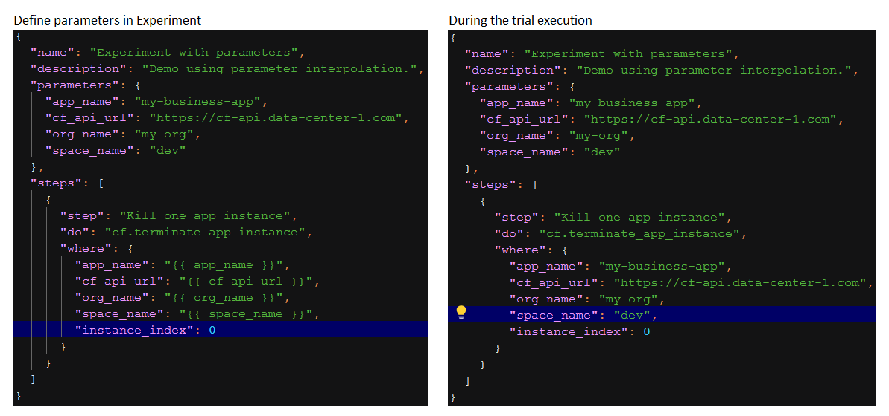
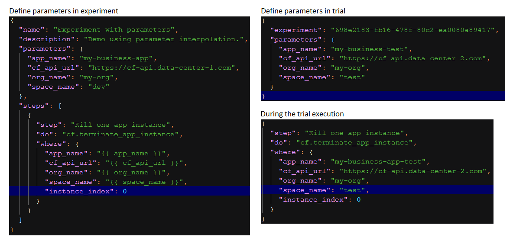

# Experiment Parameter Templating

Parameters provides Kallisti users with the ability to templatize your chaos
experiments and trials. You can define various key-value pairs in `parameters`
inside chaos experiments and trials which would be interpolated into `step`
defined under [pre_steps][pre_steps], [steps][step] and
[post_steps][post_steps].

In `where` clause of a [step][step] definition, you can refer to a template
parameter with the `parameter_name`. This will be interpolated with
`parameter_value` during trial execution. See sample below:

```json
{
  "name": "some experiment name",
  "description": "detailed description of the experiment",
  "parameters": {
    "parameter_name": "parameter_value"
  },
  "steps": [ 
    { "step": "HTTP health check",
      "do" : "cm.http_probe",
      "where": { "url" : "{{ parameter_name }}" }
    }
  ]
}
``` 

Kallisti will search the `parameters` field in experiment or trial definition
for the value with key `parameter_name`, and replace the template parameter
reference (i.e. `{{ parameter_name}}` occurrences) with the value found. This
gives the ability to maintain configuration separate from the `step`
definitions and reuse it across steps.

### Rules

* The `parameter_name` allows any combination of alphanumeric characters and
  underscore ("_").
* You cannot have spaces or punctuation characters in `parameter_name`.
* You can provide `parameters` field in either [experiment][experiment],
  [schedule][schedule], [trial][trial] definition or all of them.
* In the case where `parameters` are provided at multiple places (experiment
  and/or schedule and/or trial) then the `parameters` used for trial execution
  will be in the mentioned order of precedence: **trial over schedule over
  experiment**. <br/> You can see some [sample use cases](#sample-use-cases)
  below.
* If a `parameter_name` is used in the experiment body but not defined under
  the `parameters` object in both experiment json and trial json then the trial
  will be marked with `Invalid` status. See [Trial Status][trial_status] for
  more details.

### Sample Use Cases

**Use case 1: Providing parameters in experiment**




The example above shows experiment definition contains template parameters and
will be interpolated to the parameters value during trial execution on the
right side

**Use case 2: Providing parameters in both experiment and trial**



The example shows the interpolation effect if you provide the `parameters`
field in trial definition. The value of `parameters` provided in experiment
definition will be overwritten.

> **Note:** 
>
> This feature currently only support interpolation of String type parameters
> in experiment step. We are working on providing the complete support for
> other types of step parameters.

[experiment]: concept.md#experiment
[pre_steps]: concept.md#pre-steps
[post_steps]: concept.md#post-steps
[schedule]: scheduling.md
[step]: concepts.md#step
[trial]: concepts.md#trial
[trial_status]: concepts.md#trial-status
