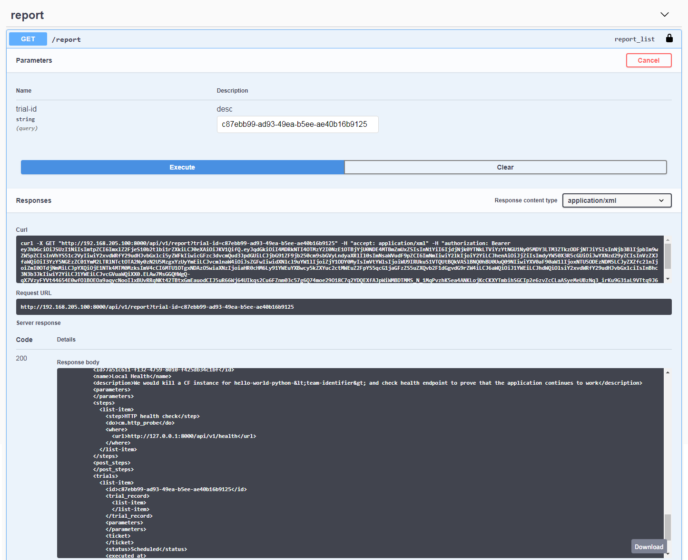

# Kallisti Reports

After a set of experiments has been executed for an application, generating and
aggregating the results of the trials would be useful as evidence to evaluate
the resiliency posture of your application.

Kallisti allows you to generate reports for your chaos experiments and related
trials. This feature enables you to inspect your product resiliency view in a
top down approach helping you to analyze multiple trial runs for the chaos
experiments.

## Current Capabilities

* XML format is supported currently.
* This feature can be accessed through the Kallisti API.
* The report can optionally be filtered using parameters such as trial ID.

## Getting Kallisti Report

1. Go to Swagger UI of your deployed Kallisti application.
2. Click `Authorize` button at the top right of the Swagger UI.
3. Enter your username and password in the modal popup then press `Authorize`
   button.
4. Go to `report` > `GET /report/`.
5. Optionally specify the trial ID in `trial-id` box under `Parameters`.
6. Press `Try It out` button.
7. The above request would generate an XML response with experiment and trial
   details.
8. Press `Download` button at the bottom right of the response window as seen
   below:
    
      
    
9. An XML report containing the experiment and trial details is downloaded
   which when opened on a browser (Chrome/Firefox) would be displayed as
   follows:

     

> **Note:**
>
> Since old browsers do not render the report according to its format, it is
> recommended to open the report in Chrome/Firefox over Internet Explorer.