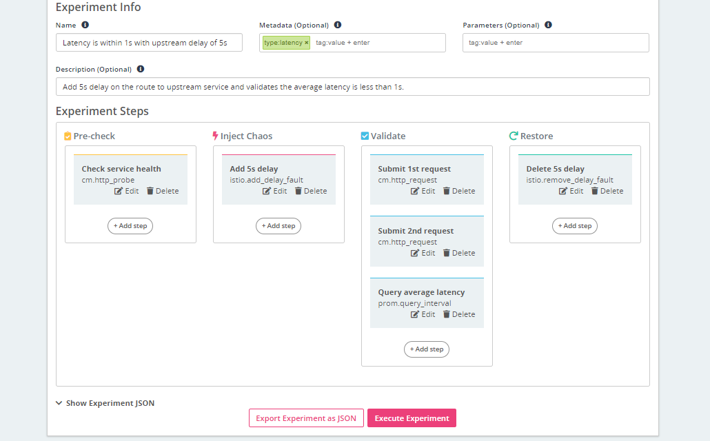

# Road Map of Kallisti

Here are some of the features that are planned to be released that we plan to
release in near future. We also welcome pull requests - please check the
[Contribution page] for more details.

* [Blazemeter Module](#blazemeter-module)
* [Chaos Experiment Builder UI](#chaos-experiment-builder-ui)
* [More Supports of Secret Vaults](#more-supports-of-secret-vaults)
* [Central Management Service](#central-management-service)

### Blazemeter Module

Our internal version of Kallisti has integrated with
[Blazemeter](https://www.blazemeter.com/) so that chaos tests can be executed
under the specified loads. We have a plan of releasing it to the OSS version of
Kallisti.

### Chaos Experiment Builder UI

Our internal version of Kallisti has a browser-based UI to build and execute
chaos experiments. We have a plan of releasing it to the OSS version of
Kallisti after removing the internal context. Here's how it looks:

### Support for More Credential Stores

We have plan of supporting the credentials vaults for more public cloud
services.

### Central Management Service

We treat Kallisti as a control plane per an organization in an enterprise, and
internally we have a central service for managing the records of chaos tests by
organizations. Kallisti instances report to this service and the centralized
data source can be used for regulatory purposes. We might consider open-sourcing
this bit as well in the future.

[Contribution Page]: ./contribution.md
